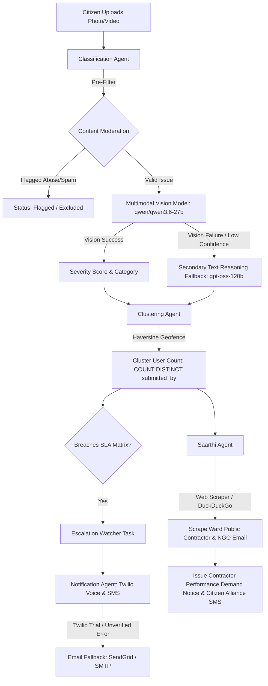

# 🏛️ Sewa: Autonomous Civic Issue Reporting & Multi-Agent Escalation Platform

**Sewa** is a civic-tech web application that empowers citizens to report local civic issues (potholes, sanitation, injured animals, fire emergencies) using smartphone camera media. Built with a multi-agent AI pipeline, Sewa automates issue classification, spatial clustering, citizen coalition building, and escalation to state/central authorities without manual administrative delays.

---

## 🏗️ Technical Stack & Architecture ("Where We Used What")

### 1. Frontend Architecture (React PWA)
- **React (Vite):** High-performance Single Page Application (SPA) client architecture.
- **Tailwind CSS:** Modern dark-mode UI design system with vibrant civic badges and micro-animations.
- **Leaflet & CartoDB Dark Matter:** Dynamic interactive neighborhood maps rendering clustered incident markers.
- **Client-Side Face Detection & Canvas Blurring (`CameraCapture.jsx`):** Automatic YCbCr skin pixel cluster analysis auto-blurs faces on mobile camera captures prior to upload for citizen privacy.
- **PWA & Offline Queue (`sw.js` & `OfflineQueue.jsx`):** Service worker Network-First strategy caching offline grievance submissions in `localStorage` and auto-syncing when internet connectivity returns.
- **GenAI Assistant ("Sewa Mitra AI" - `Chatbot.jsx`):** Floating AI chatbot providing instant progress updates, SLA countdowns, and civic guidance.

---

### 2. Backend Engine (FastAPI & Python)
- **FastAPI:** High-concurrency async Python framework powering all `/api/*` REST endpoints.
- **SQLAlchemy ORM:** Relational database abstraction layer interacting with `sqlite` / `postgresql`.
- **Haversine Spatial Math Engine (`database.py`):** Custom registered SQL SQLite/PostGIS Haversine spatial distance math function calculating 50-meter geofence bounding boxes.
- **Signed HMAC-SHA256 Auth (`main.py`):** URL-safe signed JWT authentication with Base64 padding resilience.
- **Route-Level Role-Based Access Control (RBAC):** `require_role("authority")` dependency enforcing strict HTTP 403 Forbidden enforcement against unauthorized citizen access to administrative endpoints.

---

### 3. Multi-Agent AI Pipeline (Cooperating Agents)

Sewa uses an agentic AI pipeline powered by **Groq Cloud APIs**:



- **Classification Agent (`agents/classification_agent.py`):**
  - Model: `VISION_MODEL` (`qwen/qwen3.6-27b` with fallback to `llama-3.2-11b-vision-preview`).
  - Pre-filters abusive or non-civic media.
  - Automatically triggers a secondary text reasoning pass (`REASONING_MODEL`: `openai/gpt-oss-120b`) if vision calls fail or return confidence below 0.60.
- **Clustering Agent (`agents/clustering_agent.py`):**
  - Groups grievances within a 50-meter radius into unified `ReportCluster` records.
  - Evaluates `COUNT(DISTINCT submitted_by)` citizens (enforcing distinct citizen thresholds instead of duplicate single-user reports).
  - Enforces per-user rate limiting (max 3 reports per citizen per 10 minutes).
- **Notification Agent (`agents/notification_agent.py`):**
  - Dispatches automated Twilio Voice Calls & SMS.
  - Handles Twilio trial account limitations: catches error code `21211` (unverified numbers), audits status as `failed_unverified_number`, and triggers automated HTML Email fallbacks.
- **Saarthi Agent (`agents/saarthi_agent.py`):**
  - **Public Contractor Accountability & Coalition Agent:** Performs real-time web scraping and DuckDuckGo search queries to discover local PWD contractors, municipal engineers, and regional NGOs assigned to the ward.
  - Unifies all distinct citizens who reported the cluster into a community coalition.
  - Dispatches formal contractor performance demand notices to the public works contractor.

---

## ⏱️ Explicit SLA Matrix & Escalation Thresholds

Escalation is triggered dynamically by background tasks when distinct citizen thresholds and response SLA windows breach:

| Category | Distinct Citizen Threshold | SLA Response Window | Escalation Target |
| :--- | :--- | :--- | :--- |
| **Potholes** | 5 distinct citizens | 72 hours | Ministry of Road Transport & Highways (MoRTH) |
| **Garbage / Sanitation** | 5 distinct citizens | 7 days (168h) | State Sanitation Authority |
| **Injured / Stray Animals** | 1 distinct citizen | 4 hours | Nearest Vet Hospitals & Animal NGOs |
| **Fire / Emergency** | 1 distinct citizen | 1 hour | Police, Fire Brigade, Hospital & Power Grid |

---

## 🔒 Security & Pre-Commit Secret Protection

> [!IMPORTANT]
> **No live API keys, tokens, or credentials are stored in source files.**
> All secrets are read dynamically from environment variables (`.env`).
> `.env` is listed in `.gitignore`.

### Pre-Commit Secret Scanner
Before committing changes, execute the built-in entropy/regex scanner to verify no secrets are present in tracked files:
```bash
python backend/scripts/check_secrets.py
```

---

## 🧪 Automated Test Suite (`pytest`)

Run the automated test suite covering all 5 core security, SLA, and AI fallback rules:
```bash
python -m pytest backend/tests/test_sewa.py
```

### Verified Test Cases:
1. `test_distinct_user_escalation_threshold` ✅ (5 reports from 1 user do NOT escalate; 5 distinct users DO trigger escalation).
2. `test_authority_routes_reject_citizen_jwt` ✅ (Citizen JWTs calling authority endpoints return `403 Forbidden`).
3. `test_production_env_disables_mock_otp` ✅ (`ENV=production` disables `123456` dev bypass).
4. `test_vision_failure_text_fallback` ✅ (Vision model failure triggers text reasoning fallback).
5. `test_twilio_unverified_number_handling` ✅ (Twilio unverified recipient errors produce `failed_unverified_number` audit logs).

---

## 🚀 Quick Start & Running Locally

### 1. Configure Environment
Copy `.env.example` to `.env` and fill in your keys:
```bash
cp backend/.env.example backend/.env
```

### 2. Seed Initial Database
```bash
python -m backend.seed
```

### 3. Run Automated Tests
```bash
python -m pytest backend/tests/test_sewa.py
```

### 4. Build Frontend & Launch Single-Host Server
```bash
# Build production bundle
cd frontend && npm run build && cd ..

# Launch unified server on port 8000
python -m uvicorn backend.main:app --host 0.0.0.0 --port 8000
```

Access the application at **[http://localhost:8000](http://localhost:8000)**.

---

## 👤 Author & Mandatory Credit
- **Developed by:** Manish Kumar
- **Platform:** Sewa Civic Tech Governance System
